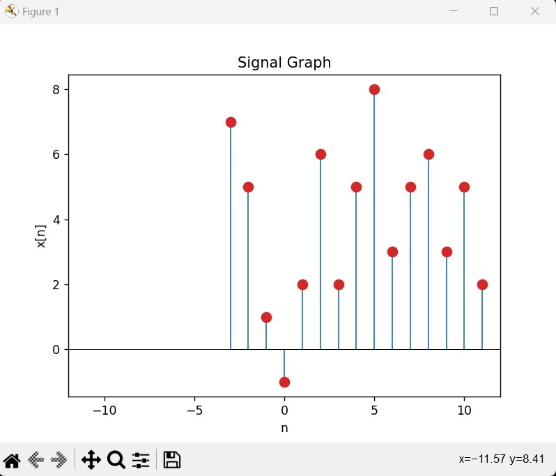
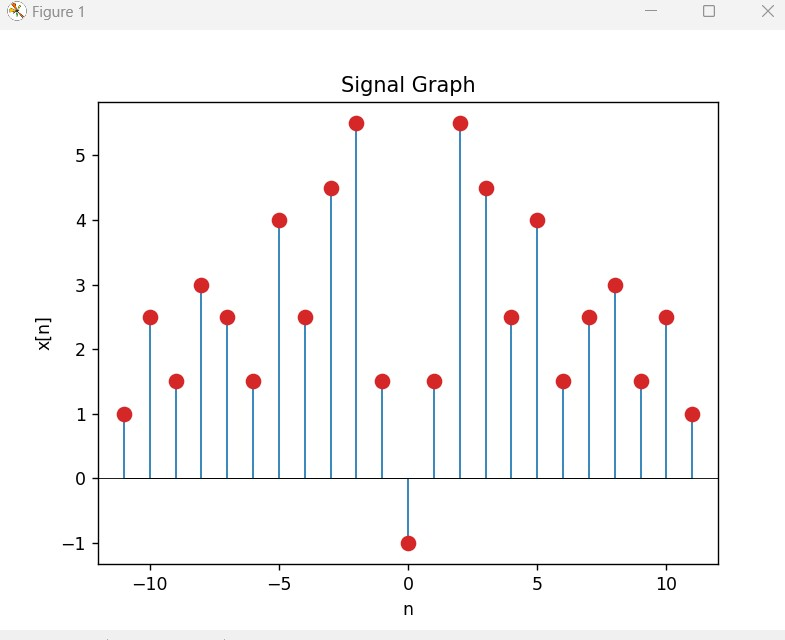
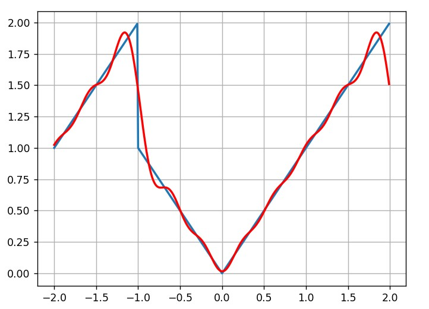

As part of the course "Introduction to Digital Signal Processing", I have implemented several python programs which manipulate finite discrete signals.

Options in the program:

Divide a signal to a sum of an odd and even signals

Original Signal:

Odd Signal:

Even Signal:

Calculate the fourier coefficints of a signal and display the N-th first coefficints and see how with the growth of N, the graph is more similar to the actual signal.

N=4

N=7

N=12

Other options:
-Flip a signal
-Multiply a signal by a scalar
-Sum signals
